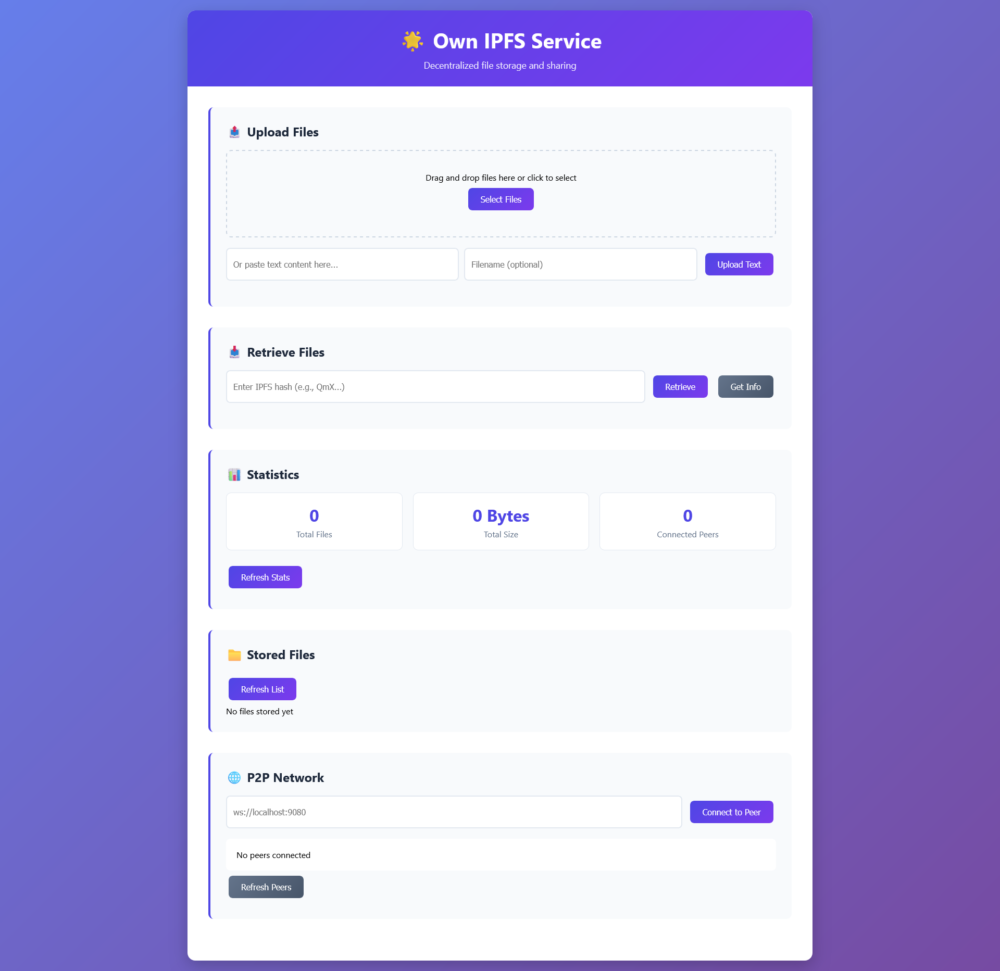

# 🌟 Own IPFS Service

A complete IPFS-like distributed file storage service built from scratch with Node.js. Store, share, and distribute files across a peer-to-peer network without relying on external IPFS services.

## ✨ Features

- **Content-Addressed Storage**: Files are stored using cryptographic hashes (IPFS-compatible format)
- **Peer-to-Peer Network**: Connect multiple nodes to share and distribute files
- **Web Interface**: Beautiful, modern web UI for easy file management
- **REST API**: Complete API for programmatic access
- **CLI Tools**: Command-line interface for advanced users
- **Real-time Stats**: Monitor storage usage and network status
- **File Metadata**: Track file information, sizes, and timestamps
- **Drag & Drop Upload**: Easy file uploading with drag and drop support

## 📸 Screenshot



*Modern web interface for easy file management and P2P file sharing*

## 📋 ToDo List & Roadmap

### 🎯 High Priority Tasks

#### Core Features
- [ ] **File Search & Filtering** - Search files by name and filter by type/size
- [ ] **File Versioning** - Track file versions and allow rollbacks
- [ ] **User Authentication** - Add basic login system and file permissions
- [ ] **File Encryption** - Encrypt files before storage for privacy
- [ ] **Automatic Peer Discovery** - Connect to peers automatically using DHT

#### UI/UX Improvements *(Great for new contributors!)*
- [ ] **Dark/Light Theme Toggle** - Add theme switcher for better user experience
- [ ] **File Preview** - Preview images, videos, and documents before download
- [ ] **Progress Bars** - Show upload/download progress to users
- [ ] **Mobile Responsive Design** - Make interface work well on phones/tablets
- [ ] **Better File Manager** - Grid view, file icons, and context menus

#### Developer Experience
- [x] **Docker Support** - Add Dockerfile and docker-compose for easy deployment ✅
- [ ] **API Documentation** - Create interactive API docs with examples
- [ ] **TypeScript SDK** - Build a client library for easier integration
- [ ] **CI/CD Pipeline** - Automated testing and deployment with GitHub Actions

### 🤝 How to Contribute

**We welcome contributors of all skill levels!** This project is perfect for:

#### 🎨 **Frontend/UI Developers**
- Improve the web interface design and user experience
- Add new UI components and features
- Make the interface mobile-friendly
- Work on themes and accessibility

#### ⚙️ **Backend Developers**
- Enhance the P2P networking layer
- Improve file storage and retrieval systems
- Add new API endpoints
- Optimize performance and security

#### 📱 **Full-Stack Developers**
- Build complete features from API to UI
- Create integration examples and demos
- Develop mobile or desktop applications

#### 🧪 **DevOps/Testing Enthusiasts**
- Set up automated testing and CI/CD
- Create Docker containers and deployment scripts
- Add monitoring and logging systems

#### 📝 **Documentation Writers**
- Write tutorials and guides
- Improve code documentation
- Create video tutorials or blog posts

### 🚀 Getting Started as a Contributor

1. **Fork the repository** and clone it locally
2. **Pick a task** from the ToDo list above (UI/UX tasks are beginner-friendly!)
3. **Create a feature branch**: `git checkout -b feature/your-feature-name`
4. **Make your changes** and test them thoroughly
5. **Submit a pull request** with a clear description

**💡 Tips for Contributors:**
- Start with smaller tasks to get familiar with the codebase
- UI/UX improvements are always welcome and don't require deep backend knowledge
- Feel free to suggest new features or improvements
- Ask questions in GitHub issues if you need help

### 🎯 Contribution Ideas by Skill Level

#### **Beginner-Friendly Tasks:**
- Add file type icons to the file list
- Improve error messages and user feedback
- Add loading animations and spinners
- Create a simple settings page

#### **Intermediate Tasks:**
- Implement file search functionality
- Add drag-and-drop multiple file upload
- Create a network status dashboard
- Build a simple file preview system

#### **Advanced Tasks:**
- Implement file encryption/decryption
- Add WebRTC support for direct peer connections
- Create a mobile app with React Native
- Build a plugin system for extensions

---

**🌟 Join our community!** Whether you're fixing a small bug or building a major feature, every contribution helps make this project better. We're here to help you succeed!

## 🚀 Quick Start

### Installation

1. **Clone the repository:**
   ```bash
   git clone https://github.com/FouadAbdi/Own-IPFS-Service.git
   cd Own-IPFS-Service
   ```

2. **Install dependencies:**
   ```bash
   npm install
   ```

3. **Start the service:**
   ```bash
   npm start
   ```

4. **Open your browser:**
   - Web Interface: http://localhost:8080
   - API Documentation: http://localhost:8080/api

### 🐳 Docker Installation (Recommended)

1. **Using Docker Compose (easiest):**
   ```bash
   git clone https://github.com/FouadAbdi/Own-IPFS-Service.git
   cd Own-IPFS-Service
   docker-compose up -d
   ```

2. **Multi-node P2P network:**
   ```bash
   docker-compose up ipfs-node1 ipfs-node2
   ```

3. **Access the services:**
   - Node 1: http://localhost:8080
   - Node 2: http://localhost:8081

📖 **Full Docker documentation:** [DOCKER.md](./DOCKER.md)

### Development Mode

```bash
npm run dev
```

This starts the service with auto-reload on file changes.

## 📖 How to Use

### Web Interface

1. **Upload Files:**
   - Drag and drop files onto the upload area
   - Or click "Select Files" to browse
   - Or paste text content directly

2. **Retrieve Files:**
   - Enter an IPFS hash (starting with "Qm")
   - Click "Retrieve" to download
   - Click "Get Info" for metadata

3. **Manage Files:**
   - View all stored files in the "Stored Files" section
   - Download, copy hash, or delete files
   - Monitor storage statistics

4. **P2P Network:**
   - Connect to other nodes using WebSocket URLs
   - Share files automatically across the network
   - Monitor connected peers

### API Endpoints

#### Upload File
```bash
# Upload a file
curl -X POST -F "file=@example.txt" http://localhost:8080/api/add

# Upload text content
curl -X POST -H "Content-Type: application/json" \
  -d '{"content":"Hello World","filename":"hello.txt"}' \
  http://localhost:8080/api/add
```

#### Retrieve File
```bash
# Get file content
curl http://localhost:8080/api/cat/QmYourHashHere

# Get file metadata
curl http://localhost:8080/api/metadata/QmYourHashHere
```

#### List Files
```bash
# List all stored files
curl http://localhost:8080/api/list

# Get storage statistics
curl http://localhost:8080/api/stats
```

#### P2P Network
```bash
# Get connected peers
curl http://localhost:8080/api/peers

# Connect to a peer
curl -X POST -H "Content-Type: application/json" \
  -d '{"peerUrl":"ws://localhost:9080"}' \
  http://localhost:8080/api/peers/connect
```

### CLI Usage

The service includes a command-line interface for advanced operations:

```bash
# Start the service
node cli.js start --port 8080 --data ./my-data

# Add a file
node cli.js add ./path/to/file.txt

# Retrieve a file
node cli.js cat QmYourHashHere --output ./downloaded-file.txt

# List all files
node cli.js list

# Show statistics
node cli.js stats

# Generate hash for content
node cli.js hash "Hello, World!"
```

## 🏗️ Architecture

### Core Components

1. **Hash Generator (`src/hash.js`)**
   - Generates IPFS-compatible hashes using SHA-256
   - Base58 encoding with "Qm" prefix
   - Deterministic content addressing

2. **Storage System (`src/storage.js`)**
   - Content-addressed block storage
   - Metadata management
   - Efficient file organization with subdirectories

3. **P2P Network (`src/p2p.js`)**
   - WebSocket-based peer communication
   - File sharing and discovery
   - Network topology management

4. **HTTP Service (`src/service.js`)**
   - Express.js REST API
   - File upload/download handling
   - Web interface serving

5. **Web Interface (`public/index.html`)**
   - Modern, responsive UI
   - Real-time updates
   - Drag & drop functionality

### File Storage Structure

```
data/
├── blocks/           # Raw file content (organized by hash)
│   ├── 12/
│   │   └── Qm12abc... 
│   └── 34/
│       └── Qm34def...
└── metadata/         # File metadata (JSON)
    ├── 12/
    │   └── Qm12abc....json
    └── 34/
        └── Qm34def....json
```

## 🔧 Configuration

### Environment Variables

- `PORT`: HTTP server port (default: 8080)
- `DATA_DIR`: Data storage directory (default: ./data)

### Programmatic Configuration

```javascript
const IPFSService = require('./src/service');

const service = new IPFSService({
  port: 3000,
  dataDir: '/custom/data/path'
});

await service.start();
```

## 🌐 P2P Network Setup

### Single Node
```bash
npm start
```

### Multiple Nodes Network

1. **Start first node:**
   ```bash
   PORT=8080 npm start
   ```

2. **Start second node:**
   ```bash
   PORT=8081 npm start
   ```

3. **Connect nodes:**
   - Open http://localhost:8080
   - Go to "P2P Network" section
   - Enter: `ws://localhost:9081`
   - Click "Connect to Peer"

4. **Verify connection:**
   - Check "Connected Peers" in both nodes
   - Upload a file to one node
   - Try to retrieve it from the other node

## 🧪 Testing

Run the test suite:

```bash
npm test
```

The tests cover:
- Hash generation and validation
- Storage operations (store, retrieve, list)
- API endpoints functionality
- P2P network communication

## 📁 Project Structure

```
Own-IPFS-Service/
├── src/
│   ├── index.js      # Main entry point
│   ├── service.js    # HTTP service and API
│   ├── storage.js    # File storage system
│   ├── hash.js       # Hash generation
│   └── p2p.js        # P2P networking
├── public/
│   └── index.html    # Web interface
├── test/
│   └── test.js       # Test suite
├── cli.js            # Command-line interface
├── package.json      # Dependencies and scripts
├── Dockerfile        # Docker container configuration
├── docker-compose.yml # Multi-container orchestration
├── .dockerignore     # Docker build exclusions
├── DOCKER.md         # Docker documentation
└── README.md         # This file
```

## 🔒 Security Considerations

- Files are stored using cryptographic hashes (SHA-256)
- Content integrity is guaranteed by hash verification
- P2P connections use WebSocket protocol
- File size limits prevent resource exhaustion
- Input validation on all API endpoints

## 🚀 Advanced Usage

### Custom Storage Backend

```javascript
const { Storage } = require('./src/storage');

class CustomStorage extends Storage {
  async store(content, filename, mimeType) {
    // Custom storage logic
    return super.store(content, filename, mimeType);
  }
}
```

### Custom P2P Protocol

```javascript
const { P2PNetwork } = require('./src/p2p');

class CustomP2P extends P2PNetwork {
  async handleMessage(peerId, data) {
    // Custom message handling
    return super.handleMessage(peerId, data);
  }
}
```

## 🤝 Contributing

1. Fork the repository
2. Create a feature branch
3. Make your changes
4. Add tests for new functionality
5. Run the test suite
6. Submit a pull request

## 📄 License

This project is licensed under the MIT License - see the LICENSE file for details.

## 🙏 Acknowledgments

- Inspired by the IPFS (InterPlanetary File System) project
- Built with modern web technologies
- Designed for educational and practical use

## 📞 Support

- Create an issue for bugs or feature requests
- Check the test suite for usage examples  
- Review the API documentation in the code

## 👨‍💻 Author

**Fouad Abdi**
- GitHub: [@FouadAbdi](https://github.com/FouadAbdi)
- Email: fouad.abdi78@gmail.com

## 🔗 Repository

- **GitHub**: https://github.com/FouadAbdi/Own-IPFS-Service
- **Issues**: https://github.com/FouadAbdi/Own-IPFS-Service/issues
- **License**: MIT

---

*Built with ❤️ by [Fouad Abdi](https://github.com/FouadAbdi) - Happy file sharing! 🎉*
